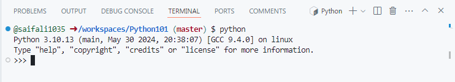
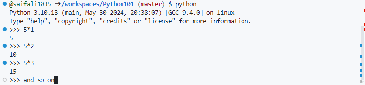
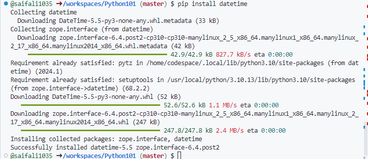
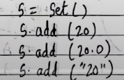

# Python101

## Chapter-1
1. Intro to Python

2. Module - Its a file containing code that can be shared among programers.

There a 2 types of module - builtin and external(can be installed using pip)

3. Pip - Its package manager for python.

4. REPL - Its python terminal that we get when we type python + enter

5. Comments - can be added as info in python file using #(single line) and '''(for multiline)

## Chapter-1 Practice set
1. write a program to print a peom - 11_PS.py
2. use REPL to print table of 5 - 
3. use and external module - 12_PS.py - 
4. use a func from os module to print content of a dir - 13_PS.py
5. use comment is 4 - 13_PS.py

## Chapter-2

1. Variables - containers to store values(can only start with character or undescore)

2. Keywords - some words are reserved in python and should not be used as variables. like import, def , etc.

3. Use of built in function type() - to check type of variable

4. Operators - used to carry out operations

Arithmatic -, +, *, /

Assigment  +=, -=, *=, /=

Comparison ==, >=, <=, <, > (prints boolean results)

Logical and, or, not ( works on boolean value) 
and- returns true when both are true
or- returns true when any one is true
not- returns the opposite

5. Typecasting - used to chnage data-type of variable.(only for valid conversions)

6. Input function - used to take input from user(assumes input as string only)

## Chapter-2 Practice set
1. program to add 2 numbers - 21_PS.py
2. find remainder when a number is divided by 2 = 21_PS.py
3. Check type of variable = 23_PS.py
4. use comparison op to find where a=34 is bigger that b=90 or not - 24_PS.py
5. program to find average of two numbers entered by user - 25_PS.py
6. program to find square of two numbers entered by user - 26_PS.py

## Chapter-3

1. Strings - Its a datatype.

Single Quoted - 'Saif' or 'Saif "WoW"'

Double Quoted - "Saif's Bike" (used when we have single quote in the sentence)

Triple Quoted - '''Saif's Bike is new.
                He is riding is bike today''' (used when we have single and double quote or new line in the sentence)

2. String concatenation - + can be used to do that

3. String Slicing - Slicing a string in python to get values suing indexes

4. String Fuctions - All important functions for string

5. Excape Sequences - \n - newline, \t - tab, \' - single quote, \\ - backslash

## Chapter-3 Practice set
1. prog to add Good Afternoon to a user entered input - 31_PS.py
2. fill a letter template - 32_PS.py
3. prog to detect double space in string - 33_PS.py
4. replace it with single string from 3 - 34_PS.py
5. use escape sequence - "Dear Saif, Can you please help \"me\". Thanks!" - 35_PS.py

## Chapter-4

1. List - containers to store a set of elements of any data type, it is ordered.

2. List slicing can be done same as string slicing.

3. List indexing can be done and items of list can be done accesed using index starting with 0.

4. List Methods - 

sort() - sorting in ascending order, cant be done with strings

reverse() - reverse the given list

append() - append an elements to last of the list

insert() - takes 2 elements and add elements to a index

pop() - removes an elements from a index and returns it

remove() - removes the first matching elements

5. Tuple - Immutable datatype (cannot be changed).

6. Tuple Methods

count() - counts the number of occurance of the elements

index() - returns the index of element's first occurance

## Chapter-4 Practice set

1. list to store seven fruits entered by user - 41_PS.py

2. Accept marks of seven students and sort them - 42_PS.py

3. Check that a tuple cannot be changed in python - 43_PS.py

4. Program to sum a list with 4 numbers - 44_PS.py

5. count number of zeroes in this tuple - (0,9,88,76,4,0,15,9,0) - - 45_PS.py

## Chapter-5

1. Dictionary - Collection of Key-Value pairs

2. Dictionary is unodered and immutable but is indexed and cannot have duplicate keys

3. Some Dictionary methods - keys()- prints keys, values() - prints values, items() - prints both key and value in tuple form, update() - updates the dict doesnot returns any value, get() - returns value or returns none

4. Set - Collection of non repetetive items where items cannot be chnaged , they are unordered and unindexed

5. To create empty set b=set()

6. Methods for set

add() - to add values and tuple but list and dict cannot be added.

len() - prints the length of the set.

remove() - removes an element.

pop() - removes the element and returns it.

clear() - clears out the set.

7. methods that works on multiple sets - 

intersection - prints commom elements.

union - prints all elemnets from all sets.

## Chapter-5 Practice set

1. Write a program to create dic of hindi words and meaning and provide user a way to look it up. - 51_PS.py

2. Take user input 8 values and dont print the duplicate values. - 52_PS.py

3. Can we have a int(1) and str(1) in a set - 53_PS.py

4. find the length of this set.
  - 3 is Answer

5. s{} - what is the type of this - Its is a dict as empty set is not created like this.

6. create an empty dic and help 4 friend add thier favourite language as value and thier name as key.(Let thier named be unique)  - 56_PS.py

7. What will happen in 6 if two friends have same name - the last value entered will override the older value

8. What will happen if in 6 two friends share same lang - duplicate values are allowed but not keys.

