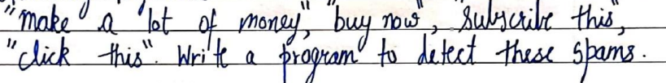

# Python101

## Chapter-1
1. Intro to Python

2. Module - Its a file containing code that can be shared among programers.

There a 2 types of module - builtin and external(can be installed using pip)


3. Pip - Its package manager for python.

4. REPL - Its python terminal that we get when we type python + enter


5. Comments - can be added as info in python file using #(single line) and '''(for multiline)

## Chapter-1 Practice set
1. write a program to print a peom - 11_PS.py
2. use REPL to print table of 5 - 
3. use and external module - 12_PS.py - 
4. use a func from os module to print content of a dir - 13_PS.py
5. use comment is 4 - 13_PS.py


## Chapter-2

1. Variables - containers to store values(can only start with character or undescore)

2. Keywords - some words are reserved in python and should not be used as variables. like import, def , etc.

3. Use of built in function type() - to check type of variable

4. Operators - used to carry out operations

Arithmatic -, +, *, /

Assigment  +=, -=, *=, /=

Comparison ==, >=, <=, <, > (prints boolean results)

Logical and, or, not ( works on boolean value) 
and- returns true when both are true
or- returns true when any one is true
not- returns the opposite

5. Typecasting - used to chnage data-type of variable.(only for valid conversions)

6. Input function - used to take input from user(assumes input as string only)

## Chapter-2 Practice set
1. program to add 2 numbers - 21_PS.py
2. find remainder when a number is divided by 2 = 21_PS.py
3. Check type of variable = 23_PS.py
4. use comparison op to find where a=34 is bigger that b=90 or not - 24_PS.py
5. program to find average of two numbers entered by user - 25_PS.py
6. program to find square of two numbers entered by user - 26_PS.py

## Chapter-3

1. Strings - Its a datatype.

Single Quoted - 'Saif' or 'Saif "WoW"'

Double Quoted - "Saif's Bike" (used when we have single quote in the sentence)

Triple Quoted - '''Saif's Bike is new.
                He is riding is bike today''' (used when we have single and double quote or new line in the sentence)

2. String concatenation - + can be used to do that

3. String Slicing - Slicing a string in python to get values suing indexes

4. String Fuctions - All important functions for string

5. Excape Sequences - \n - newline, \t - tab, \' - single quote, \\ - backslash


## Chapter-3 Practice set
1. prog to add Good Afternoon to a user entered input - 31_PS.py
2. fill a letter template - 32_PS.py
3. prog to detect double space in string - 33_PS.py
4. replace it with single string from 3 - 34_PS.py
5. use escape sequence - "Dear Saif, Can you please help \"me\". Thanks!" - 35_PS.py

## Chapter-4

1. List - containers to store a set of elements of any data type, it is ordered.

2. List slicing can be done same as string slicing.

3. List indexing can be done and items of list can be done accesed using index starting with 0.

4. List Methods - 

sort() - sorting in ascending order, cant be done with strings

reverse() - reverse the given list

append() - append an elements to last of the list

insert() - takes 2 elements and add elements to a index

pop() - removes an elements from a index and returns it

remove() - removes the first matching elements

5. Tuple - Immutable datatype (cannot be changed).

6. Tuple Methods

count() - counts the number of occurance of the elements

index() - returns the index of element's first occurance

## Chapter-4 Practice set

1. list to store seven fruits entered by user - 41_PS.py

2. Accept marks of seven students and sort them - 42_PS.py

3. Check that a tuple cannot be changed in python - 43_PS.py

4. Program to sum a list with 4 numbers - 44_PS.py

5. count number of zeroes in this tuple - (0,9,88,76,4,0,15,9,0) - - 45_PS.py


## Chapter-5

1. Dictionary - Collection of Key-Value pairs

2. Dictionary is unodered and immutable but is indexed and cannot have duplicate keys

3. Some Dictionary methods - keys()- prints keys, values() - prints values, items() - prints both key and value in tuple form, update() - updates the dict doesnot returns any value, get() - returns value or returns none

4. Set - Collection of non repetetive items where items cannot be chnaged , they are unordered and unindexed

5. To create empty set b=set()

6. Methods for set

add() - to add values and tuple but list and dict cannot be added.

len() - prints the length of the set.

remove() - removes an element.

pop() - removes the element and returns it.

clear() - clears out the set.

7. methods that works on multiple sets - 

intersection - prints commom elements.

union - prints all elemnets from all sets.

## Chapter-5 Practice set

1. Write a program to create dic of hindi words and meaning and provide user a way to look it up. - 51_PS.py

2. Take user input 8 values and dont print the duplicate values. - 52_PS.py

3. Can we have a int(1) and str(1) in a set - 53_PS.py

4. find the length of this set.
  - 3 is Answer

5. s{} - what is the type of this - Its is a dict as empty set is not created like this.

6. create an empty dic and help 4 friend add thier favourite language as value and thier name as key.(Let thier named be unique)  - 56_PS.py

7. What will happen in 6 if two friends have same name - the last value entered will override the older value

8. What will happen if in 6 two friends share same lang - duplicate values are allowed but not keys.


## Chapter-6

1. Conditional Expressions

2. if Else loop - Multiway decision taking


## Chapter-6 Practice set

1. Program to find greatest of four number entered by user. - 61_PS.py

2. Program to declare PASs or FAIL for a user input percentage. - 62_PS.py

3. Write a program that can detect these spam words -  - 63_PS.py

4. program to find a give a username has less than 10 char or not - 64_PS.py

5. find grade of a user from following scheme  - 65_PS.py

6. find if in a given paragraph "Harry" is written or not. - 66_PS.py


## Chapter-7

1. Loops - Help us with repetition .

2. While - keeps executing until condition is true. In this condition is checked first

3. For - iterate trough list, sequence, tuple

4. range fucntion in python - is used to create and iterate through a range of numbers

5. break statemnet - break the lopp on basis of a condition

6. continue statement - to skip the loop of one iteration based on condition set

7. pass statement - placeholder for future code.


## Chapter-7 Practice set

1. Multiplicationm table of a given number using for loop - 71_PS.py

2. Greet all the names in a list that start with S. - 71_PS.py

3. Do 1 using while loop. - 71_PS.py

4. find if a number is prime or not. - 71_PS.py

5. find sum of n natural number using while loop. - 71_PS.py

6. find factorial of a number using for loop - 71_PS.py


## Chapter-8

1. Functions - group of statement that performs a specific task, its reusable and makes program easy to read.

2. We have userdefined(what we make) and built-in fucntions(print()) in python.

3. Recursion - A function that call itself within its defenition


## Chapter-8 Practice set

1. a function to find greatest of 3 num. - 81_PS.py

2. a function to convert celcius to farenheit. - 82_PS.py

3. how to prevent a python print function from printing a new line. - 83_PS.py

4. write a recursive function for some of first n natural numbers. - 84_PS.py


## Project 1

Snake, Water and Gun game in python.

```Python
#Importing random to use random fuction for computer to enter its value in the game.
import random

#this function helps us to print the user's choice in the game.
def game_keywords(word):
    if word=='s':
        print("Snake")
    if word=='w':
        print("Water")
    if word=='g':
        print("Gun")


#Banner Can be modeified to your liking
print('''         Hello User Welcome to the GAME !!!
         Computer has chosen its option
         Now its your turn !!!''')

#Taking user input
user_choice=input("Enter your choice : Snake(s), Water(w) or Gun(g) :")

#Generating Random number between 1, 2 and 3 for computer input in the game.
random_choice_for_comp_int=random.randint(1,3)

#Converting random number to a choice valid in game
if random_choice_for_comp_int==1:
    computer_choice='s'
elif random_choice_for_comp_int==2:
    computer_choice='w'
elif random_choice_for_comp_int==3:
    computer_choice='g'

#Game Logic (Snake wins over Water , Gun win over Snake and Water wins over Gun.)
if computer_choice==user_choice:
    print("Match Draw ! You both choose", game_keywords(computer_choice) )
elif computer_choice=='s' and user_choice=='w':
    print("You Lost !  As Computer Choose Snake !")
elif computer_choice=='s' and user_choice=='g':
    print("You Won !   As Computer Choose Snake !")
elif computer_choice=='w' and user_choice=='s':
    print("You Won !   As Computer Choose Water !")
elif computer_choice=='w' and user_choice=='g':
    print('You Lost !  As Computer Choose Water !')
elif computer_choice=='g' and user_choice=='s':
    print('You Lost !  As Computer Choose Gun !')
elif computer_choice=='g' and user_choice=='w':
    print('You Won !   As Computer Choose Gun !')
else:
    print("Invalid Choice ! ")
```


## Chapter-9

1. File I/O - Operations done on file using python as RAM is volatile.

2. Type of files - text files(Characters are written on it and its generally meant for reading) and binary files( a not normal text files and are generally meant for some specific program like a .jpg file is meant to be read or viewed using image viewer only).

3. File Functions - 

Open a file - var = open("file_name", "mode")  - default mode if nothing specified is "r" and post opening a file its is good habit to close it using close() function, so that other programs can also use it and our program doesn't keeps a hold on that file. - Available modes are r(read), rb(read in binary), rt(read in text), w(write), append(a) and +(update)


Reading a file - once opened we can use var.read("number of char") - default if nothing specified is to read everything , it returns the data can then it can be stored in a var to printed directly.


readline() - reads only one line. - first occurance in program reads first line , second occurance reads second and so on.

4. with statement - It is called at context manager and its the best way to open and close file automatically.


## Chapter-9 Practice set

1. read from a file poem.txt and find if it has word twinkle- 91_PS.py

2. a function that will update the file. 92_PS.py

3. write multiplication table for a user for each digit(2-13) in a diff file and store them in a dir. 93_PS.py

4. A file contains a word "Donkey" multiple times write a program which replcaes it with ######. 94_PS.py

5. Repeat 4 but with a list of words. 95_PS.py

6. find a string in the file and print its position.  96_PS.py

7. Copy one file to another. 97_PS.py

8. Check if two files are identical. 98_PS.py


## Chapter-10

1. OOP - Its not necessary but a way of problem solving in python. principle of using code reuse.

2. Class - Blueprint for creating objects. 

3. Object - Object is the instantaniation of the class. While class is just template and doesnot occupy memory, memory is only occupied when class is initialized.

4. Technique to model any problem in OOPs. 

5. Instance attribute(attribute that you change using class instance) takes precedence over class attribute(attribute defined within class)

6. Self Parameter - Its is a parameter that is passed auto when we call any of the objects.

7. Static Method - a Method that doesn't uses self parameter, Use keyword - @staticmethod

8. __init__() constructor - A special method that runs as soon as object is created.


## Chapter-10 Practice set

1. Create a class to store data of some microsoft employees.

2. Write a calculator class capable of finding square root and square qube of a number.

3. A Static method to greet user


